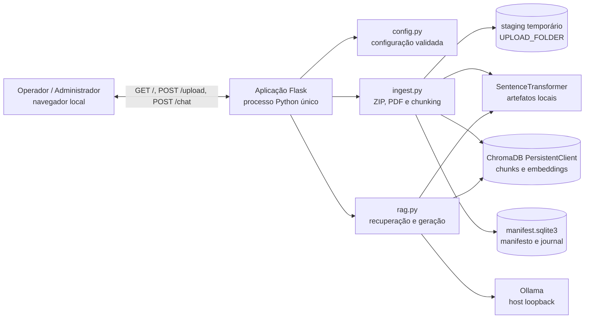
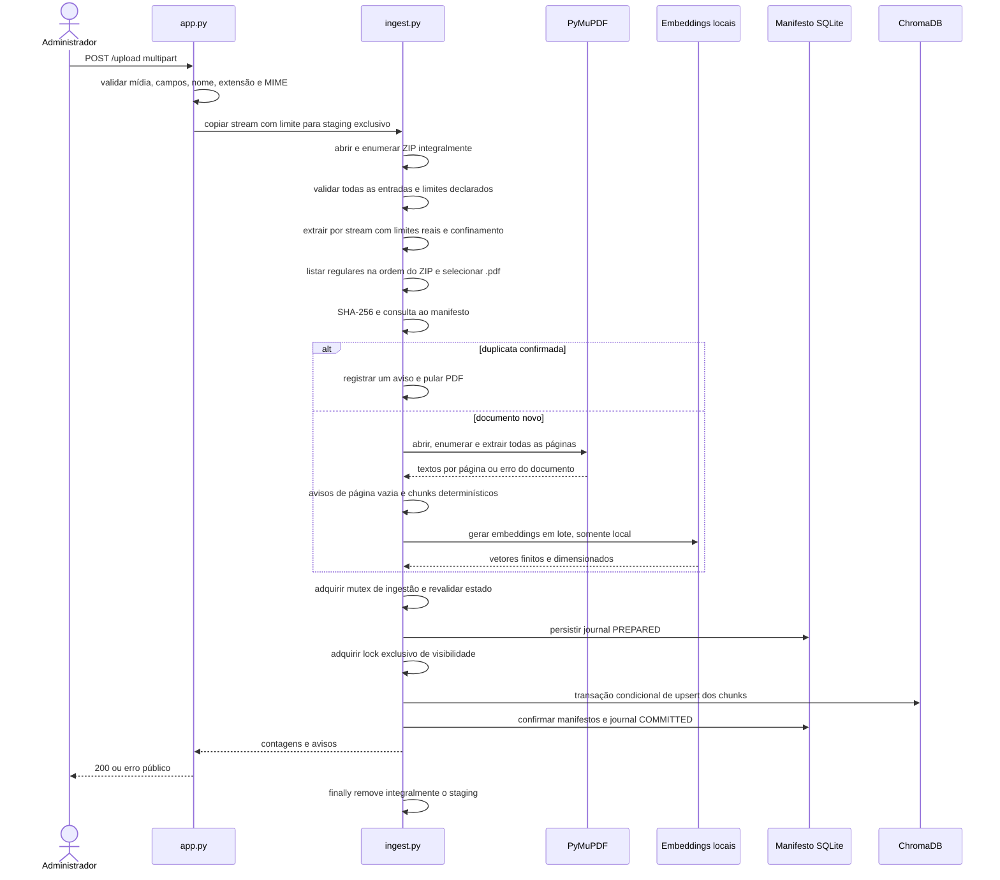
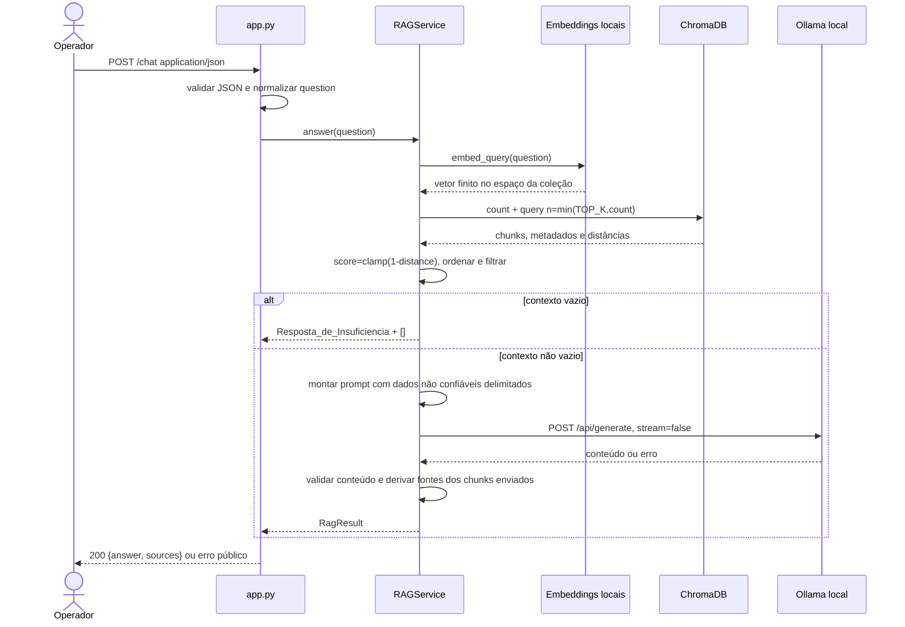

# Design Document

## Overview

### Propósito

O ERP AI Support será uma aplicação web monolítica Flask, executada em um único processo Python 3.11+ no Ambiente_Local. O sistema receberá exclusivamente arquivos ZIP contendo PDFs, extrairá texto página a página com PyMuPDF, produzirá chunks rastreáveis, gerará embeddings locais com sentence-transformers, persistirá os chunks em ChromaDB embutido e responderá perguntas por meio de recuperação semântica e geração no Ollama local.

O design mantém o MVP deliberadamente pequeno: não há integração com o ERP, banco de dados do ERP, autenticação, histórico, OCR, execução de código, LangChain, React, backend Node.js, microsserviços, Kubernetes nem API externa. `app.py` é o composition root e a fronteira HTTP; `ingest.py` contém o pipeline documental; `rag.py` contém embeddings, armazenamento vetorial, recuperação e geração; `config.py` centraliza configuração; `domain.py` contém apenas tipos compartilhados e erros públicos para evitar dependências circulares.

### Objetivos de design

1. Manter documentos, embeddings, perguntas, contexto e respostas no Ambiente_Local.
2. Tornar toda afirmação retornada dependente dos chunks recuperados e nunca de histórico ou conhecimento externo.
3. Rejeitar ZIPs inseguros antes da extração e limitar bytes declarados e efetivamente escritos.
4. Preservar a origem exata de cada chunk até as Fontes retornadas pela API.
5. Garantir idempotência por identidades SHA-256 determinísticas.
6. Oferecer atomicidade observável e recuperação de falhas compatíveis com um MVP de processo único.
7. Separar lógica pura de I/O para permitir testes unitários e testes baseados em propriedades sem modelos reais.
8. Produzir contratos HTTP e erros públicos estáveis, sem dados internos.

### Decisões principais

| Decisão | Escolha e justificativa |
|---|---|
| Forma de implantação | Um processo Flask, com threads permitidas. A exclusão mútua é garantida dentro desse processo; uma trava de arquivo de ciclo de vida impede uma segunda instância sobre o mesmo `CHROMA_PATH`. |
| Organização | Quatro módulos funcionais (`app.py`, `config.py`, `ingest.py`, `rag.py`) e um módulo sem comportamento de negócio (`domain.py`) para dataclasses, protocolos e `PublicError`. |
| Embeddings | `sentence-transformers/paraphrase-multilingual-MiniLM-L12-v2`, carregado com `local_files_only=True`, `trust_remote_code=False` e saída normalizada. É multilíngue, adequado à busca semântica e produz vetores de 384 dimensões no modelo padrão. |
| Distância | Coleção Chroma configurada com espaço `cosine`. A distância retornada é convertida em relevância por `score = clamp(1 - distance, -1, 1)`. |
| Persistência | Chunks e embeddings ficam em uma coleção Chroma `PersistentClient`; um SQLite sidecar da biblioteca padrão mantém somente manifesto de documentos e journal de recuperação. Não contém texto de pergunta ou resposta. |
| Atomicidade | Todo processamento caro ocorre antes da escrita. A confirmação usa lock exclusivo de visibilidade, transação condicional da coleção, journal persistente e compensação na inicialização. Não se presume atomicidade de uma sequência de `upsert` comuns. |
| Geração | Chamada HTTP direta a `/api/generate` do Ollama, sem SDK de orquestração, sem proxy, sem redirects e apenas para host loopback validado. |
| Frontend | HTML, CSS e JavaScript puro; todo conteúdo não confiável entra no DOM por `textContent` ou `createTextNode`. |
| Perfil de chunking | Uma coleção aceita um único par `CHUNK_SIZE`/`CHUNK_OVERLAP` e uma única `CHUNK_SCHEMA_VERSION`. Alterar o perfil exige recriar o índice, evitando IDs iguais com textos incompatíveis. |

### Pesquisa técnica que informa o design

- O [PersistentClient do Chroma](https://cookbook.chromadb.dev/core/clients/) persiste dados em um caminho local e é indicado para aplicações embutidas. Isso sustenta a escolha de não executar um servidor Chroma separado.
- Na [configuração de coleções do Chroma](https://docs.trychroma.com/docs/collections/configure), a distância cosseno é definida como `1 - similaridade_cosseno`; por isso o limiar dos requisitos, expresso como similaridade, não pode ser comparado diretamente à distância retornada.
- A [API de consulta do Chroma](https://docs.trychroma.com/docs/querying-collections/query-and-get) aceita embeddings fornecidos pela aplicação, exige dimensão compatível e retorna documentos, metadados e distâncias. A [referência de Collection](https://docs.trychroma.com/reference/python/collection) também documenta transações condicionais com snapshot estável, além das limitações de não consultar dentro da transação e não abranger múltiplas coleções.
- A [API de SentenceTransformer](https://www.sbert.net/docs/package_reference/sentence_transformer/SentenceTransformer.html) oferece `local_files_only`, `trust_remote_code` e `normalize_embeddings`. O [model card do modelo padrão](https://huggingface.co/sentence-transformers/paraphrase-multilingual-MiniLM-L12-v2) registra o uso para busca semântica e a dimensão 384.
- A [documentação de `zipfile`](https://docs.python.org/3.11/library/zipfile.html) alerta contra extração de arquivos não confiáveis e recomenda validação de caminhos; o design, portanto, não usa `extract()` nem `extractall()` e faz cópia limitada entrada por entrada.
- O [padrão de upload do Flask](https://flask.palletsprojects.com/en/stable/patterns/fileuploads/) documenta `MAX_CONTENT_LENGTH` e `RequestEntityTooLarge`; esse limite global é defesa adicional, enquanto o limite autoritativo do arquivo é contado durante a cópia do stream.
- A [API local do Ollama](https://docs.ollama.com/api) e a especificação de [`/api/generate`](https://raw.githubusercontent.com/ollama/ollama/main/docs/api.md) permitem resposta não streaming; `num_predict`, documentado entre os [parâmetros de modelo](https://raw.githubusercontent.com/ollama/ollama/main/docs/modelfile.mdx), limita tokens gerados. [`/api/tags`](https://docs.ollama.com/api/tags) permite verificar modelos locais.
- O conteúdo consultado foi reformulado para cumprir restrições de licenciamento; os links acima são as fontes autoritativas.

### Escopo e não objetivos

A implementação cobre somente ingestão de PDF via ZIP, indexação, consulta semântica, geração local fundamentada e exibição de fontes. O manifesto SQLite é metadado técnico interno necessário para deduplicar inclusive documentos sem chunks e recuperar transações; ele não cria cadastro, versionamento, categorização, histórico ou nova base de conhecimento. Não haverá endpoint adicional no MVP.

## Architecture

### Visão de contexto e componentes



A única comunicação de rede da aplicação é a resposta ao navegador local e a chamada ao Ollama em `localhost`, `127.0.0.1` ou `::1`. ChromaDB, SQLite, PyMuPDF e sentence-transformers são bibliotecas no mesmo processo. Nenhum componente aceita instruções dos documentos como comando executável.

### Estrutura de arquivos planejada

```text
.
├── app.py                 # criação Flask, composição, rotas e mapeamento HTTP
├── config.py              # leitura .env/ambiente, conversão e validação
├── domain.py              # dataclasses, enums, protocolos e PublicError
├── ingest.py              # upload seguro, ZIP, PDF, chunking e transação
├── rag.py                 # embeddings, Chroma, recuperação, prompt e Ollama
├── templates/
│   └── index.html
├── static/
│   ├── style.css
│   └── script.js
├── documents/
│   └── uploads/           # staging temporário; vazio fora de operações
├── data/
│   └── chroma/            # Chroma, manifesto, journal e lock local
├── requirements.txt
├── .env.example
└── README.md
```

`domain.py` não é uma camada ou serviço adicional. Ele evita que `ingest.py` importe `app.py` ou que `rag.py` importe implementações de ingestão, preservando o monólito modular.

### Fluxo de ingestão



Regras de ordenação importantes:

1. Nenhuma entrada é extraída antes de todas as entradas terem passado pela validação declarada.
2. Nenhum arquivo é oferecido ao extrator de PDF antes da extração integral do ZIP.
3. A ordem das entradas no diretório central do ZIP é preservada para decidir a primeira ocorrência de um PDF duplicado.
4. Extração de texto, chunking e embeddings terminam antes da primeira modificação persistente.
5. O staging é removido em `finally`, tanto em sucesso quanto em qualquer exceção.

### Fluxo de chat



Cada chamada é independente. `RAGService` não recebe, consulta nem grava identificador de sessão, pergunta anterior, resposta anterior ou fontes anteriores.

### Inicialização e ciclo de vida

1. `main()` chama `create_app()`.
2. `load_config()` lê `.env`, ambiente e defaults, converte tudo e valida relações cruzadas.
3. Os diretórios configurados são criados/validados antes da construção dos serviços.
4. O processo adquire `CHROMA_PATH/.erp-ai-support.lock` com `fcntl.flock(..., LOCK_EX | LOCK_NB)`. Falha significa que outra instância usa a base; a aplicação encerra com erro público, pois multiprocesso não é suportado.
5. `PersistentClient` e `ManifestStore` são abertos. A recuperação de journals incompletos ocorre antes de registrar as rotas como prontas.
6. O modelo de embedding é carregado de modo preguiçoso na primeira ingestão ou consulta, sempre com `local_files_only=True`. Isso permite abrir a UI para diagnóstico, mas a operação dependente retorna 503 se o modelo não estiver local.
7. A coleção é aberta ou criada somente depois de conhecida a dimensão real do modelo. Coleção existente é validada antes de ser entregue a ingestão ou consulta.
8. `app.run(host=config.flask_host, port=config.flask_port, debug=config.flask_debug)` é executado somente no bloco `if __name__ == "__main__"`.

### Fronteiras de confiança

- **Não confiável:** bytes do upload, nomes de entradas ZIP, texto de PDFs, pergunta, resposta do Ollama e corpos HTTP.
- **Confiável após validação:** `AppConfig`, caminhos resolvidos, metadados lidos da coleção que passaram pelo guard de compatibilidade e DTOs construídos internamente.
- **Nunca executado:** não são usados `eval`, `exec`, `subprocess`, shell, import dinâmico a partir de dados, renderização HTML de conteúdo nem `trust_remote_code=True`.
- **Rede:** o cliente Ollama ignora configurações de proxy, não segue redirects e resolve o host novamente para confirmar que todos os endereços são loopback. HTTPS usa validação TLS normal; certificados não são desabilitados.
- **Arquivos:** staging usa diretório `0700` e arquivos `0600`; permissões de execução são removidas explicitamente após cada criação.

### Persistência, concorrência e atomicidade

#### Estruturas persistentes

- A coleção `${CHROMA_COLLECTION}` armazena apenas registros de tipo chunk.
- `CHROMA_PATH/manifest.sqlite3` armazena `vector_space`, `documents` e `ingestion_transactions`.
- `CHROMA_PATH/.erp-ai-support.lock` impede duas instâncias da aplicação.
- `UPLOAD_FOLDER/upload-<uuid4>/` existe somente durante um upload.

SQLite é controle transacional local, não um segundo repositório de conteúdo: não guarda embeddings, texto extraído, chunks, perguntas ou respostas. Ele é necessário porque um documento processado pode ter zero chunks e ainda precisa ser reconhecido como duplicata.

#### Compatibilidade da coleção

Na criação, a coleção recebe configuração de índice cosseno e metadados imutáveis:

- `schema_version = 1`
- `record_type = "chunk"` nos registros
- `embedding_model`
- `embedding_dimension`
- `embedding_normalized = true`
- `distance_metric = "cosine"`
- `chunk_schema_version = "char-v1"`
- `chunk_size`
- `chunk_overlap`

Em coleção existente, cada valor é comparado antes de qualquer `count`, `query` ou escrita. Divergência no modelo, dimensão, normalização ou métrica produz `vector_space_mismatch`; divergência no perfil de chunking produz `chunk_profile_mismatch`. Nenhum metadado existente é alterado automaticamente. A orientação pública é recriar o índice.

A implementação deve fixar uma versão exata do Chroma cuja API pública ofereça transação condicional por coleção. O adaptador usará uma única transação com IDs explícitos; não usará consulta dentro dela, não fará transação entre coleções e não gravará o mesmo ID duas vezes na mesma transação.

#### Protocolo de confirmação

1. `ingestion_mutex` serializa uploads a partir da consulta definitiva de duplicatas. Tentativa concorrente recebe 409.
2. Antes de escrever, o serviço consulta IDs existentes. ID ausente entra em `new_chunk_ids`; ID existente com campos idênticos é um upsert idempotente; ID existente com qualquer campo divergente gera conflito e aborta.
3. Uma transação SQLite grava journal `PREPARED`, lista de `new_chunk_ids`, manifestos pretendidos e checksum do plano.
4. `visibility_lock` é adquirido em modo exclusivo. Consultas usam o mesmo lock em modo compartilhado, logo nenhuma consulta observa a janela de confirmação ou compensação.
5. A transação condicional Chroma aplica todos os upserts. Falha não confirma writes da transação.
6. O journal passa para `CHROMA_COMMITTED`.
7. Uma transação SQLite insere os manifestos e marca o journal `COMMITTED`.
8. O lock de visibilidade é liberado. Somente então o resultado pode ser retornado.

Em exceção após um commit Chroma, ainda sob lock exclusivo, uma transação condicional remove somente `new_chunk_ids`; IDs preexistentes idênticos não são removidos. Se a compensação falhar, o serviço entra em estado `recovery_required`, bloqueia chat e upload com 503 e não finge sucesso.

Na inicialização, antes de aceitar requisições, journals `PREPARED` ou `CHROMA_COMMITTED` são tratados como uploads não confirmados: os `new_chunk_ids` são removidos, manifestos não confirmados são descartados e o journal vira `ABORTED`. Journal `COMMITTED` é preservado. Assim, uma queda do processo não expõe estado parcial na próxima execução.

#### Limites da garantia

- A garantia é para exatamente um processo da aplicação e uma coleção local. O MVP não suporta múltiplos workers ou acesso externo concorrente ao mesmo diretório Chroma.
- O journal coordena Chroma e SQLite, mas não constitui uma transação distribuída. A segurança após queda depende de a base Chroma continuar legível para compensação; corrupção física resulta em 503 e recuperação administrativa, nunca em confirmação silenciosa.
- Se a versão exata de Chroma selecionada na implementação não oferecer a transação condicional documentada, não é permitido substituir por vários `upsert` sem garantia. A dependência deve ser ajustada ou o design revisto antes da implementação.
- A busca HNSW é aproximada. O limiar filtra apenas os candidatos devolvidos entre os `TOP_K`; ele não prova que nenhum outro chunk da coleção ultrapassaria o limiar.

### Decisões e riscos operacionais

| Risco | Tratamento no MVP |
|---|---|
| `RELEVANCE_THRESHOLD=0.30` não calibrado para o corpus real | Manter configurável, registrar apenas métricas não sensíveis localmente e validar com conjunto pequeno de perguntas esperado/insuficiente. Não alterar dinamicamente o limiar. |
| Modelo de embedding não está no cache | Carregamento estritamente local falha com erro acionável. O README inclui pré-download e teste offline. |
| Ollama indisponível ou modelo ausente | Preflight local e mapeamento de falhas distintos; nenhum fallback para API externa ou conhecimento geral. |
| Prompt injection | Dados são delimitados e rotulados como não confiáveis; não existem ferramentas, shell ou função executável; saída é texto inerte. |
| Garantia semântica de fundamentação por LLM | Prompt restritivo e validador conservador reduzem risco, mas não demonstram entailment formal. Conteúdo duvidoso é convertido em Resposta_de_Insuficiencia; a limitação é documentada. |
| PDFs digitalizados | Página sem caracteres não brancos gera aviso; OCR permanece fora do escopo. |
| Ordem de texto do PDF | É exatamente a ordem devolvida por `Page.get_text("text")`; o MVP não reordena layout. |
| Upload no servidor Flask de desenvolvimento | Limite do stream e `MAX_CONTENT_LENGTH` são testados; o README alerta que o servidor de desenvolvimento pode encerrar conexão em vez de entregar 413 em alguns cenários. |
| Grandes volumes dentro dos limites | Texto intermediário é gravado no staging por página para não reter todo PDF em RAM; embeddings são gerados em lotes. Transação ainda pode pressionar memória e é limitada pelos limites do ZIP. |
| Segundo processo | Lock de ciclo de vida impede abertura. Escalar para multiprocessos exige outro mecanismo e fica fora do MVP. |

## Components and Interfaces

### `domain.py`: contratos compartilhados

Responsabilidades:

- declarar dataclasses imutáveis usadas entre módulos;
- declarar `PublicError` com código, mensagem e status;
- declarar protocolos `EmbeddingProvider`, `VectorStore` e `GeneratorClient` para injeção em testes;
- não importar Flask, PyMuPDF, Chroma, sentence-transformers ou Ollama.

Interfaces centrais:

```python
class EmbeddingProvider(Protocol):
    def ensure_ready(self) -> VectorSpace: ...
    def embed_documents(self, texts: Sequence[str]) -> list[list[float]]: ...
    def embed_query(self, text: str) -> list[float]: ...

class VectorStore(Protocol):
    def ensure_compatible(self, space: VectorSpace, profile: ChunkingProfile) -> None: ...
    def count_chunks(self) -> int: ...
    def existing_chunks(self, ids: Sequence[str]) -> Mapping[str, StoredChunk]: ...
    def commit_chunks(self, plan: CommitPlan) -> None: ...
    def rollback_new_chunks(self, ids: Sequence[str]) -> None: ...
    def query(self, embedding: Sequence[float], limit: int) -> list[RawCandidate]: ...
```

`PublicError` nunca recebe exceção interna, caminho absoluto, texto extraído, chunk, prompt ou contexto. Exceções técnicas são encadeadas apenas no log local (`raise ... from exc`).

### `config.py`: configuração centralizada

`config.py` é tecnicamente necessário porque todas as rotas e serviços dependem do mesmo conjunto validado e porque erros de configuração devem impedir estado parcialmente inicializado.

Assinaturas:

```python
def load_config(
    environ: Mapping[str, str] | None = None,
    cwd: Path | None = None,
    dotenv_path: Path | None = None,
) -> AppConfig: ...

def validate_local_ollama_url(raw: str) -> str: ...
def ensure_data_directory(raw: str, variable: str, cwd: Path) -> Path: ...
def parse_bool(raw: str, variable: str) -> bool: ...
def parse_int(raw: str, variable: str, minimum: int, maximum: int | None = None) -> int: ...
def parse_float(raw: str, variable: str, minimum: float, maximum: float | None = None) -> float: ...
def parse_megabytes(raw: str, variable: str) -> tuple[Decimal, int]: ...
def validate_collection_compatibility(
    config: AppConfig,
    actual_space: VectorSpace,
    recorded_metadata: Mapping[str, object],
) -> None: ...
```

Algoritmo de carregamento:

1. Determinar `.env` no diretório de inicialização.
2. Se existir, verificar que é arquivo regular legível e chamar `dotenv_values()` do python-dotenv. Erro de I/O, sintaxe reportada ou valor não interpretável aborta tudo.
3. Compor somente as chaves conhecidas: `defaults < .env < os.environ`.
4. Aplicar `strip()` em toda representação textual antes da conversão.
5. Converter cada valor para seu tipo. Booleano aceita exclusivamente `true` ou `false`, sem distinguir maiúsculas.
6. Validar limites individuais e relações `CHUNK_OVERLAP < CHUNK_SIZE` e `MAX_UNCOMPRESSED_MB >= MAX_ZIP_ENTRY_MB`.
7. Interpretar MB com `Decimal`, sem ponto flutuante binário, e multiplicar exatamente por `1_048_576`. Todo número decimal positivo é aceito; como bytes recebidos são inteiros, o limite operacional é `floor(valor_em_MB * 1_048_576)`, isto é, o maior número inteiro de bytes que não excede o valor configurado.
8. Resolver caminhos relativos contra `cwd`, criar diretórios quando permitido e validar leitura/escrita com criação e remoção de arquivo sentinela. Mensagens citam apenas o nome da variável.
9. Validar URL: esquema HTTP/HTTPS; host textual exatamente permitido; sem usuário/senha; porta válida; sem fragmento; path base preservado de forma normalizada. Na conexão, a resolução DNS deve continuar loopback.
10. Construir uma única instância `AppConfig(frozen=True)`; nenhum componente lê `os.environ` diretamente.

O `ChromaVectorStore` lê os metadados persistidos, mas delega a decisão pura a `validate_collection_compatibility()`. Assim, incompatibilidade de espaço vetorial ou perfil de chunking continua sendo uma rejeição da configuração central, e nenhum componente recebe uma coleção utilizável antes dessa segunda etapa de validação.

`FLASK_HOST` aceita somente os três hosts locais definidos. `FLASK_DEBUG` padrão falso. O Exemplo_de_Ambiente deverá conter exatamente uma ocorrência de cada variável, mas essa verificação pertence aos testes/documentação, não ao carregador em runtime.

### `app.py`: composição e fronteira HTTP

Assinaturas:

```python
def create_app(config: AppConfig | None = None) -> Flask: ...
def register_routes(app: Flask, services: Services) -> None: ...
def error_response(error: PublicError) -> tuple[Response, int]: ...
def validate_chat_request(request: Request, max_chars: int) -> str: ...
def validate_upload_contract(request: Request) -> UploadDescriptor: ...
def copy_upload_bounded(source: BinaryIO, destination: Path, max_bytes: int) -> int: ...
def main() -> None: ...
```

`create_app()` instancia uma vez `LocalEmbeddingService`, `ManifestStore`, `ChromaVectorStore`, `IngestionService`, `RetrievalService`, `OllamaClient` e `RAGService`. As instâncias são injetadas; não há singletons ocultos nem leitura de ambiente dentro dos serviços.

#### `GET /`

- Renderiza `templates/index.html` com status 200.
- Não injeta conteúdo de documentos no template.
- A página contém título, subtítulo, formulário de chat, resposta, fontes, formulário de upload, status, avisos e contadores `documents`, `pages`, `chunks`.

#### `POST /chat`

Validação em ordem:

1. `request.mimetype == "application/json"`; parâmetros como charset não alteram o media type.
2. Corpo presente, JSON bem formado e raiz `dict`.
3. Campo `question` presente e do tipo `str`; booleanos/números não são convertidos.
4. `len(question)` antes da normalização não excede `MAX_QUESTION_CHARS`; em Python 3, isso conta pontos de código Unicode.
5. `question.strip()` não é vazio. O `strip()` padrão cobre whitespace Unicode.
6. Somente o texto aparado é enviado a `RAGService`.

Qualquer rejeição encerra antes de embedding, Chroma ou Ollama. Campos JSON adicionais são tolerados e ignorados porque o requisito exige “ao menos” `question`.

Sucesso fundamentado ou insuficiente retorna status 200 e exatamente:

```json
{"answer": "texto", "sources": [{"document": "manual.pdf", "page": 3}]}
```

#### `POST /upload`

Validação em ordem:

1. Requisição multipart.
2. `request.files` contém exatamente uma ocorrência no campo `file` e zero arquivos em outros campos.
3. Nome não é `None` nem `""`.
4. Sufixo `.zip` case-insensitive.
5. MIME pertence à allowlist.
6. Cópia do stream para staging exclusivo, em blocos, contando bytes. Cada leitura é limitada a `restante + 1`; ao detectar o byte excedente, nenhum byte acima do limite é escrito e toda a área é descartada.
7. Abertura ZIP e enumeração integral sem erro.

`MAX_CONTENT_LENGTH` é configurado com o limite compactado acrescido de uma pequena margem fixa para framing multipart, apenas como defesa antecipada. A contagem do conteúdo do campo `file` é a decisão autoritativa. `RequestEntityTooLarge` é normalizado para 413.

Sucesso retorna exatamente:

```json
{
  "success": true,
  "documents": 2,
  "pages": 18,
  "chunks": 31,
  "warnings": []
}
```

Todos os erros de chat e upload usam o mesmo envelope top-level:

```json
{"success": false, "code": "stable_code", "message": "Mensagem pública em português do Brasil."}
```

O upload sempre inclui `success: false`, e o chat usa o mesmo formato para uniformidade. Respostas de sucesso não incluem `success` no chat, preservando o contrato exato.

#### Tratamento global

- `PublicError` é convertido pelo status declarado.
- `RequestEntityTooLarge` vira erro 413 estável.
- JSON malformado vira erro 400 estável.
- Exceção não reconhecida é registrada com stack trace local e retorna 500 genérico.
- A resposta nunca serializa `str(exc)` de exceções técnicas.

### `ingest.py`: validação, extração e preparação documental

#### Serviço de ingestão

```python
class IngestionService:
    def ingest(self, archive_path: Path, upload_id: UUID) -> UploadResult: ...

class ZipValidator:
    def inspect(self, archive_path: Path, extraction_root: Path) -> ArchivePlan: ...
    def extract(self, archive_path: Path, plan: ArchivePlan) -> list[ExtractedEntry]: ...

class PdfExtractor:
    def extract(self, entry: ExtractedEntry, spool_root: Path) -> ExtractedDocument: ...

class ChunkingService:
    def split_page(self, page: PdfPage, document: DocumentIdentity) -> list[Chunk]: ...
```

#### Plano e validação do ZIP

`ZipValidator.inspect()` abre `zipfile.ZipFile` e materializa `infolist()` por completo. Para cada `ZipInfo`, antes de extrair qualquer entrada:

- incrementa a quantidade total, incluindo diretórios;
- rejeita nome com byte nulo, caminho absoluto POSIX, UNC, prefixo de unidade, barra inicial, segmento `..` ou componente de controle;
- interpreta tanto `/` quanto `\` como separadores para a análise de segurança;
- lê bits Unix de `external_attr` quando disponíveis e rejeita link simbólico, socket, FIFO, device e qualquer tipo especial;
- aceita somente diretório ou arquivo regular; entrada DOS sem modo Unix explícito é tratada conforme `is_dir()` ou arquivo regular;
- calcula `target = (extraction_root / relative_path).resolve(strict=False)` e exige `os.path.commonpath([root, target]) == str(root)`; comparação de prefixo textual não é usada;
- rejeita dois membros cujo destino normalizado seja o mesmo;
- verifica `MAX_ZIP_ENTRIES`, `MAX_ZIP_ENTRY_BYTES`, `MAX_UNCOMPRESSED_BYTES` e razão declarada;
- para `file_size > 0` e `compress_size == 0`, rejeita; para `compress_size > 0`, exige `file_size / compress_size <= MAX_COMPRESSION_RATIO`.

O plano contém a ordem original das entradas. Mensagens públicas indicam apenas a categoria (`entry_count`, `entry_bytes`, `total_bytes`, `compression_ratio`, `unsafe_entry`) e nunca repetem o nome malicioso.

#### Extração limitada

`ZipValidator.extract()` não chama `extract()` nem `extractall()`. Para cada entrada aprovada:

1. cria pais com modo `0700`;
2. abre destino com criação exclusiva (`xb`), impedindo overwrite;
3. lê `ZipFile.open(info)` em blocos de até 64 KiB;
4. mantém contadores real por entrada e total;
5. antes de cada escrita, compara o bloco com bytes restantes e aborta sem gravar bytes excedentes;
6. fecha, aplica `chmod(0o600)` e registra `ExtractedEntry` somente após sucesso completo;
7. captura CRC, método não suportado, criptografia, truncamento e I/O como falha de extração.

A lista só é retornada depois de todas as entradas concluírem. Em falha, o chamador remove a raiz inteira; nenhuma lista parcial chega ao PDF extractor.

#### Nome exibível e descoberta

Arquivos regulares são percorridos pela lista `ExtractedEntry`, não por ordenação do sistema de arquivos. Isso descobre raiz e subpastas e preserva a ordem declarada no ZIP.

`normalize_display_name(info.filename)`:

- usa caminho relativo POSIX já validado;
- normaliza Unicode em NFC;
- remove C0, C1 e DEL de cada segmento;
- mantém subpastas separadas por `/`;
- nunca inclui staging, caminho absoluto ou segmento perigoso.

Cada regular não terminado em `.pdf` case-insensitive gera um aviso por ocorrência. Ausência de candidatos `.pdf` gera 422 antes de qualquer escrita persistente.

#### Identidade e deduplicação

```python
def sha256_file(path: Path) -> str: ...
def make_chunk_id(document_id: str, page: int, start: int, schema: str) -> str: ...
```

`document_id` é o hexadecimal SHA-256 dos bytes extraídos, que são idênticos aos bytes do PDF dentro do ZIP. O hash é calculado antes de abrir o PDF ou gerar chunks.

`chunk_id` é:

```text
"chk_" + SHA256(
    UTF8(chunk_schema_version) || NUL ||
    ASCII(document_id) || NUL ||
    ASCII(human_page) || NUL ||
    ASCII(start_offset)
).hexdigest()
```

O perfil de chunking é fixo por coleção, portanto os campos definidos nos requisitos determinam univocamente o ID dentro dela.

Antes da extração PDF, o manifesto é consultado pela chave composta por identidade, fingerprint do espaço vetorial, `CHUNK_SIZE`, `CHUNK_OVERLAP` e versão. Duplicata confirmada gera exatamente um aviso para a ocorrência e pula PDF, chunks e embeddings. Dentro do mesmo ZIP, `seen_document_ids` só é atualizado quando a primeira ocorrência satisfaz integralmente a definição de Documento_PDF; ocorrências posteriores são puladas. Mesmo nome com bytes diferentes possui hash diferente e não substitui dados anteriores.

A checagem é repetida sob `ingestion_mutex` imediatamente antes da confirmação para evitar race. Tentativas falhas nunca entram na tabela `documents`.

#### Extração PDF e contagens

O extrator usa `pymupdf.open(path)` e, para índices `0..page_count-1`, chama `document.load_page(index).get_text("text")`. Cada texto é gravado em arquivo UTF-8 temporário por página para limitar memória, sem alteração de caracteres.

- `human_page = index + 1`.
- `text.strip() == ""` caracteriza página sem texto.
- Página sem texto conta em `pages`, gera aviso único com nome sanitizado/página/OCR e produz zero chunks.
- Se qualquer abertura, enumeração ou extração falhar, o documento inteiro é ignorado, seus spools são removidos e um único aviso de leitura é produzido.
- Documento com todas as páginas vazias conta em `documents` e `pages`, gera zero chunks e recebe manifesto após transação bem-sucedida.
- Se nenhum candidato PDF for legível, o upload termina em 422 e zero alterações.

`documents` conta somente documentos novos abertos e processados integralmente; `pages` soma todas as páginas desses documentos; `chunks` conta somente novos IDs confirmados. `WarningCollector` usa chave estrutural `(code, entry_ordinal, page_or_none)` para não duplicar o mesmo evento e mantém ordem de produção.

#### Chunking

Para texto não vazio, com `size = CHUNK_SIZE`, `overlap = CHUNK_OVERLAP` e `stride = size - overlap`:

```python
start = 0
while start < len(text):
    end = min(start + size, len(text))
    emit(text[start:end], start)
    if end == len(text):
        break
    start += stride
```

Não há trim, normalização, inserção, remoção ou reordenação. Um chunk nunca cruza página. Texto com tamanho até `size` produz um único chunk em zero. O último chunk é o primeiro que contém o último caractere. Cada chunk carrega documento, nome exibível, página humana, offset inicial, texto, ID, transaction ID e tipo `chunk`.

#### Plano de persistência

Após todos os documentos:

1. `EmbeddingProvider.ensure_ready()` valida o espaço.
2. Textos são codificados em lotes; nenhum lote é persistido ainda.
3. Cada vetor é convertido para lista de `float`, tem dimensão e finitude verificadas.
4. `CommitPlan` reúne chunks, embeddings, manifestos, contagens e warnings.
5. O protocolo de confirmação da arquitetura é executado.

Qualquer falha anterior ao commit descarta o plano em memória e staging. Qualquer falha durante commit executa rollback/recovery.

### `rag.py`: embeddings, armazenamento, recuperação e geração

#### `LocalEmbeddingService`

```python
class LocalEmbeddingService(EmbeddingProvider):
    def ensure_ready(self) -> VectorSpace: ...
    def embed_documents(self, texts: Sequence[str]) -> list[list[float]]: ...
    def embed_query(self, text: str) -> list[float]: ...
    def _validate(self, vectors: object, expected_count: int) -> list[list[float]]: ...
```

O modelo é criado uma vez, sob lock, com:

- `SentenceTransformer(config.embedding_model, local_files_only=True, trust_remote_code=False)`;
- nenhuma função de download e nenhuma credencial;
- `encode(..., convert_to_numpy=True, normalize_embeddings=True, show_progress_bar=False)`;
- o mesmo método e a mesma normalização para chunks e perguntas;
- dimensão obtida de `get_sentence_embedding_dimension()` e confirmada pela primeira saída.

Ausência local é convertida em `embedding_model_missing`. Erro de inferência vira `embedding_failed`. Vetor vazio, dimensão divergente, `NaN` ou infinito é rejeitado antes de uso ou persistência.

#### `ManifestStore`

```python
class ManifestStore:
    def recover_incomplete(self, vector_store: ChromaVectorStore) -> None: ...
    def is_duplicate(self, key: DocumentManifestKey) -> bool: ...
    def prepare(self, plan: CommitPlan) -> TransactionJournal: ...
    def mark_chroma_committed(self, tx_id: str) -> None: ...
    def commit_manifests(self, tx_id: str, manifests: Sequence[DocumentManifest]) -> None: ...
    def abort(self, tx_id: str) -> None: ...
```

SQLite usa foreign keys, WAL e `synchronous=FULL`. Toda instrução usa parâmetros. O arquivo permanece sob `CHROMA_PATH` e nunca é servido por HTTP.

#### `ChromaVectorStore`

```python
class ChromaVectorStore(VectorStore):
    def ensure_compatible(self, space: VectorSpace, profile: ChunkingProfile) -> None: ...
    def count_chunks(self) -> int: ...
    def existing_chunks(self, ids: Sequence[str]) -> Mapping[str, StoredChunk]: ...
    def commit_chunks(self, plan: CommitPlan) -> None: ...
    def rollback_new_chunks(self, ids: Sequence[str]) -> None: ...
    def query(self, embedding: Sequence[float], limit: int) -> list[RawCandidate]: ...
```

Usa `chromadb.PersistentClient(path=str(config.chroma_path))`. A aplicação fornece embeddings diretamente; não registra embedding function do Chroma. A coleção é criada com índice cosseno usando a forma da API da versão exata fixada. Ao reabrir, configuração e metadados são lidos e comparados, não sobrescritos.

`query()` executa:

```python
collection.query(
    query_embeddings=[list(embedding)],
    n_results=limit,
    include=["documents", "metadatas", "distances"],
)
```

O adaptador valida a forma columnar retornada, presença de campos, tipos, metadados e finitude da distância. Erro de leitura vira indisponibilidade 503; erro de gravação durante upload aciona rollback e 503.

#### `RetrievalService`

```python
class RetrievalService:
    def retrieve(self, question: str) -> tuple[RetrievedChunk, ...]: ...

def cosine_distance_to_relevance(distance: float) -> float: ...
```

Algoritmo:

1. Gerar embedding da pergunta no espaço validado.
2. Sob lock compartilhado de visibilidade, obter `count_chunks()`.
3. Se zero, retornar contexto vazio.
4. Definir `limit = min(TOP_K, count)`; `TOP_K` já foi validado entre 5 e 8.
5. Consultar exatamente `limit` candidatos.
6. Para cada posição original `i`, calcular `score = max(-1.0, min(1.0, 1.0 - distance))`.
7. Ordenar estavelmente por score decrescente; empates preservam `i`.
8. Reter exatamente candidatos com `score >= RELEVANCE_THRESHOLD`.
9. Construir `RetrievedChunk` somente de registros válidos de tipo chunk.

Distância não finita ou resposta inconsistente do Chroma não é tratada como baixa relevância; é erro de dependência. Se o contexto ficar vazio, Ollama não é chamado.

#### Prompt e proteção contra injeção

```python
def build_prompt(question: str, context: Sequence[RetrievedChunk]) -> str: ...
def validate_generated_answer(answer: str, context: Sequence[RetrievedChunk]) -> GroundingDecision: ...
def derive_sources(context: Sequence[RetrievedChunk]) -> tuple[Source, ...]: ...
```

O prompt possui quatro blocos, nesta ordem:

1. **Papel:** assistente de suporte ao ERP.
2. **Regras imutáveis:** português do Brasil; somente contexto; sem inferência; insuficiência exata; frases completas; sem saudação; procedimentos numerados; nomes de menus/campos/telas literais; limite conciso.
3. **Contexto não confiável:** cada chunk recebe identificador interno, documento e página, e texto serializado como string JSON para que delimitadores no próprio PDF não fechem o bloco.
4. **Pergunta não confiável:** também serializada como string JSON.

O prompt afirma explicitamente que instruções dentro dos dois blocos são dados sem autoridade. A aplicação não fornece tools, function calling, acesso a arquivos, processo, shell ou rede ao modelo.

O validador pós-geração aplica uma política conservadora:

- conteúdo vazio/branco é falha de geração;
- correspondência exata à Resposta_de_Insuficiencia é aceita com fontes vazias;
- resposta não vazia deve estar dentro do limite retornado pelo Ollama e não pode conter envelope de erro;
- números, códigos e nomes literais apresentados precisam ocorrer no contexto;
- cada frase factual deve compartilhar evidência lexical substantiva com ao menos um chunk; frase sem evidência é rejeitada;
- resposta rejeitada é substituída pela Resposta_de_Insuficiencia, nunca por conhecimento geral.

Essa checagem é deliberadamente de alta precisão e pode recusar respostas válidas. Ela não prova entailment semântico; esse risco residual é registrado e não é mascarado por uma segunda chamada de LLM.

`derive_sources()` ignora qualquer citação textual produzida pelo modelo. Percorre exatamente o contexto enviado, cria pares `(display_name, human_page)`, elimina duplicatas por set preservando a primeira ocorrência e produz objetos com somente `document` e `page`. Se a resposta final for insuficiente, a lista é forçada a vazia.

#### `OllamaClient`

```python
class OllamaClient(GeneratorClient):
    def list_models(self, deadline: float) -> set[str]: ...
    def generate(self, prompt: str, max_tokens: int, timeout_seconds: int) -> str: ...
```

- Usa cliente HTTP da biblioteca padrão diretamente, sem proxy e sem redirect.
- Usa deadlines monotônicos separados: até `OLLAMA_TIMEOUT_SECONDS` para estabelecer/verificar a conexão local e um novo prazo integral de `OLLAMA_TIMEOUT_SECONDS`, contado do início do `POST /api/generate`, para concluir a geração. Cada operação de socket usa somente o tempo restante de seu respectivo prazo.
- Verifica `/api/tags`; ausência exata do modelo configurado gera `ollama_model_missing` com `ollama pull <modelo>`.
- Faz `POST /api/generate` com `model`, `prompt`, `stream: false`, `think: false` quando suportado e `options: {"num_predict": MAX_ANSWER_TOKENS, "temperature": 0.1}`.
- Não envia `context` anterior e não conserva conversa.
- Usa somente o campo `response`; campos de thinking, métricas e contexto não entram na resposta.
- Falha de conexão é `ollama_unavailable`; 404/model not found após preflight é `ollama_model_missing`; timeout, JSON inválido, interrupção ou resposta vazia são `generation_failed`.
- Conteúdo parcial é descartado.

#### `RAGService`

```python
class RAGService:
    def answer(self, question: str) -> RagResult: ...
```

Coordenação:

1. recuperar contexto;
2. se vazio, devolver insuficiência sem Ollama;
3. montar prompt apenas com contexto recuperado;
4. gerar localmente;
5. validar resposta;
6. se insuficiente ou inválida, `sources=()`;
7. caso fundamentada, fontes derivadas do contexto, limitadas naturalmente a `TOP_K` pares.

### `templates/index.html`, `static/style.css` e `static/script.js`

#### Estrutura HTML

A página usa HTML sem framework, labels associados, regiões `aria-live` para status e elementos separados para:

- título `ERP AI Support`;
- subtítulo `Suporte interno baseado em documentos`;
- textarea/campo de pergunta e botão `Perguntar`;
- resposta com `white-space: pre-wrap`;
- lista de Fontes;
- seção `Base de conhecimento`;
- `<input type="file" accept=".zip">` e botão `Importar`;
- status, lista de avisos e três contadores nomeados.

#### Layout CSS

Em viewport de conteúdo com 1280 px, um container com largura máxima e `box-sizing: border-box` usa grid de colunas que nunca excede `minmax(0, 1fr)`. Textos longos recebem `overflow-wrap: anywhere`; controles usam `max-width: 100%`; não há largura fixa maior que o viewport. Um teste de navegador verifica `document.documentElement.scrollWidth <= clientWidth` e ausência de interseções indevidas.

#### Comportamento JavaScript

`script.js` mantém dois flags independentes, `chatPending` e `uploadPending`.

```javascript
async function submitQuestion(event) { /* fetch('/chat') */ }
async function submitUpload(event) { /* fetch('/upload') */ }
function renderText(element, value) { element.textContent = value; }
function renderSources(sources) { /* createElement + textContent */ }
function renderWarnings(warnings) { /* createElement + textContent */ }
```

- Antes do chat válido: resposta `Consultando...`, campo e botão desabilitados.
- `finally`: controles reabilitados e flag limpo.
- Sucesso: `answer` por `textContent`; fontes antigas removidas e recriadas na ordem `document — página N`.
- Upload: `Processando...`, seletor/botão desabilitados; sucesso mostra `Concluído`, substitui contadores e warnings.
- Erro HTTP: valida envelope e exibe somente `message`; pergunta ou seleção não são limpas.
- Erro de rede ou schema incompatível: mensagem genérica local e valores de entrada preservados.
- Novo submit é ignorado enquanto o flag correspondente está ativo.
- Nunca é usado `innerHTML`, `insertAdjacentHTML`, template string HTML ou atributo de evento com dado externo.

## Data Models

### Dataclasses de domínio

As definições abaixo são contratos de design; não constituem implementação de produção.

```python
from dataclasses import dataclass
from pathlib import Path
from typing import Literal

@dataclass(frozen=True, slots=True)
class AppConfig:
    ollama_url: str
    ollama_model: str
    chroma_path: Path
    chroma_collection: str
    upload_folder: Path
    embedding_model: str
    top_k: int
    chunk_size: int
    chunk_overlap: int
    relevance_threshold: float
    max_upload_bytes: int
    max_zip_entries: int
    max_zip_entry_bytes: int
    max_uncompressed_bytes: int
    max_compression_ratio: float
    max_question_chars: int
    ollama_timeout_seconds: int
    max_answer_tokens: int
    flask_host: str
    flask_port: int
    flask_debug: bool

@dataclass(frozen=True, slots=True)
class PublicError(Exception):
    code: str
    message: str
    http_status: int

@dataclass(frozen=True, slots=True)
class VectorSpace:
    model: str
    dimension: int
    normalized: bool
    metric: Literal["cosine"]

    @property
    def fingerprint(self) -> str: ...

@dataclass(frozen=True, slots=True)
class ChunkingProfile:
    size: int
    overlap: int
    schema_version: Literal["char-v1"]

@dataclass(frozen=True, slots=True)
class UploadDescriptor:
    filename: str
    mimetype: str

@dataclass(frozen=True, slots=True)
class ArchiveEntryPlan:
    ordinal: int
    archive_name: str
    relative_path: str
    resolved_target: Path
    is_directory: bool
    declared_size: int
    compressed_size: int

@dataclass(frozen=True, slots=True)
class ArchivePlan:
    entries: tuple[ArchiveEntryPlan, ...]
    declared_total_bytes: int

@dataclass(frozen=True, slots=True)
class ExtractedEntry:
    ordinal: int
    path: Path
    display_name: str
    size: int

@dataclass(frozen=True, slots=True)
class PdfPage:
    human_page: int
    text: str

@dataclass(frozen=True, slots=True)
class ExtractedDocument:
    document_id: str
    display_name: str
    pages: tuple[PdfPage, ...]

@dataclass(frozen=True, slots=True)
class Chunk:
    chunk_id: str
    document_id: str
    display_name: str
    human_page: int
    start_offset: int
    text: str
    transaction_id: str

@dataclass(frozen=True, slots=True)
class StoredChunk:
    chunk: Chunk
    embedding: tuple[float, ...]

@dataclass(frozen=True, slots=True)
class DocumentManifestKey:
    document_id: str
    vector_fingerprint: str
    chunk_size: int
    chunk_overlap: int
    chunk_schema_version: str

@dataclass(frozen=True, slots=True)
class DocumentManifest:
    key: DocumentManifestKey
    first_display_name: str
    page_count: int
    chunk_count: int
    transaction_id: str

@dataclass(frozen=True, slots=True)
class UploadResult:
    success: Literal[True]
    documents: int
    pages: int
    chunks: int
    warnings: tuple[str, ...]

@dataclass(frozen=True, slots=True)
class RawCandidate:
    original_index: int
    chunk_id: str
    document: str
    metadata: dict[str, object]
    distance: float

@dataclass(frozen=True, slots=True)
class RetrievedChunk:
    chunk_id: str
    text: str
    document_id: str
    display_name: str
    human_page: int
    score: float

@dataclass(frozen=True, slots=True)
class Source:
    document: str
    page: int

@dataclass(frozen=True, slots=True)
class RagResult:
    answer: str
    sources: tuple[Source, ...]

@dataclass(frozen=True, slots=True)
class CommitPlan:
    transaction_id: str
    chunks: tuple[StoredChunk, ...]
    manifests: tuple[DocumentManifest, ...]
    new_chunk_ids: tuple[str, ...]
    documents: int
    pages: int
    warnings: tuple[str, ...]

@dataclass(frozen=True, slots=True)
class TransactionJournal:
    transaction_id: str
    state: Literal["PREPARED", "CHROMA_COMMITTED", "COMMITTED", "ABORTED"]
    new_chunk_ids: tuple[str, ...]
    plan_checksum: str
```

### Schema dos registros Chroma

- **ID Chroma:** `chunk_id`.
- **document:** texto exato do chunk.
- **embedding:** vetor normalizado e validado.
- **metadata:** somente escalares aceitos pelo Chroma:

| Campo | Tipo | Invariante |
|---|---|---|
| `record_type` | string | sempre `chunk` |
| `document_id` | string | SHA-256 hexadecimal |
| `display_name` | string | relativo, sanitizado, sem controle |
| `page` | int | `>= 1` |
| `start_offset` | int | `>= 0` |
| `transaction_id` | string | UUID interno |
| `chunk_schema_version` | string | `char-v1` |

O texto não é duplicado em metadata. Perguntas, respostas e score não são persistidos.

### Schema do manifesto SQLite

```sql
CREATE TABLE vector_space (
    singleton INTEGER PRIMARY KEY CHECK (singleton = 1),
    fingerprint TEXT NOT NULL,
    model TEXT NOT NULL,
    dimension INTEGER NOT NULL,
    normalized INTEGER NOT NULL CHECK (normalized IN (0, 1)),
    metric TEXT NOT NULL CHECK (metric = 'cosine'),
    chunk_size INTEGER NOT NULL,
    chunk_overlap INTEGER NOT NULL,
    chunk_schema_version TEXT NOT NULL
);

CREATE TABLE ingestion_transactions (
    transaction_id TEXT PRIMARY KEY,
    state TEXT NOT NULL CHECK (state IN (
        'PREPARED', 'CHROMA_COMMITTED', 'COMMITTED', 'ABORTED'
    )),
    new_chunk_ids_json TEXT NOT NULL,
    manifests_json TEXT NOT NULL,
    plan_checksum TEXT NOT NULL,
    created_at_utc TEXT NOT NULL
);

CREATE TABLE documents (
    document_id TEXT NOT NULL,
    vector_fingerprint TEXT NOT NULL,
    chunk_size INTEGER NOT NULL,
    chunk_overlap INTEGER NOT NULL,
    chunk_schema_version TEXT NOT NULL,
    first_display_name TEXT NOT NULL,
    page_count INTEGER NOT NULL CHECK (page_count >= 0),
    chunk_count INTEGER NOT NULL CHECK (chunk_count >= 0),
    transaction_id TEXT NOT NULL,
    PRIMARY KEY (
        document_id, vector_fingerprint, chunk_size,
        chunk_overlap, chunk_schema_version
    ),
    FOREIGN KEY (transaction_id)
        REFERENCES ingestion_transactions(transaction_id)
);
```

Somente transações `COMMITTED` qualificam documentos como duplicatas. JSON do journal contém IDs e metadados técnicos, nunca texto de chunk.

### Modelo uniforme de erro

| Campo | Tipo | Regra |
|---|---|---|
| `success` | boolean | sempre `false` |
| `code` | string | estável por condição, ASCII snake_case |
| `message` | string | português do Brasil, não vazia e acionável |

Não existem campos `details`, `trace`, `path`, `exception`, `prompt` ou `context`. Códigos e status são definidos na seção de tratamento de erros.

### Invariantes de dados

1. `0 <= chunk_overlap < chunk_size`.
2. Todo `Chunk.text == PdfPage.text[start_offset:start_offset + len(Chunk.text)]`.
3. Todo chunk pertence a uma única página e a um único documento.
4. Todo embedding é finito e possui `VectorSpace.dimension` componentes.
5. Toda consulta usa o mesmo fingerprint vetorial da coleção.
6. Todo `Source` deriva de um `RetrievedChunk` efetivamente enviado ao Ollama.
7. Nenhuma pergunta ou resposta é gravada em Chroma, SQLite ou arquivo.
8. Um manifesto existe somente para transação `COMMITTED`.
9. Chunks visíveis fora do lock exclusivo pertencem somente a transações confirmadas.
10. `display_name` nunca contém caminho absoluto nem caractere de controle.

### Rastreabilidade de requisitos para o design

| Requisito | Elementos de design |
|---|---|
| 1 | Fronteiras de confiança, operação local, cliente Ollama loopback, ausência de executor e persistência local. |
| 2 | Estrutura monolítica, árvore de arquivos, responsabilidades de `app.py`, `ingest.py`, `rag.py` e frontend puro. |
| 3 | `config.py`, `AppConfig`, precedência, defaults, conversões, diretórios e guard de compatibilidade. |
| 4 | `GET /`, estrutura HTML e layout CSS para 1280 px. |
| 5 | Contrato de `POST /upload`, cópia limitada, staging exclusivo e cleanup. |
| 6 | `ZipValidator.inspect/extract`, confinamento, tipos especiais e limites declarados/reais. |
| 7 | Ordem de entradas, nomes exibíveis, PyMuPDF, spool por página, avisos e falha integral do PDF. |
| 8 | SHA-256, manifesto, `seen_document_ids`, IDs determinísticos e confirmação transacional. |
| 9 | Algoritmo de chunking, DTO `Chunk`, offsets, cobertura e contagem. |
| 10 | `LocalEmbeddingService`, modelo multilíngue local, normalização, dimensão e espaço vetorial. |
| 11 | PersistentClient, manifesto/journal, locks, transação condicional, rollback e recuperação. |
| 12 | `RetrievalService`, `min(TOP_K,count)`, conversão de distância, ordenação estável e threshold. |
| 13 | `build_prompt`, dados não confiáveis, cliente Ollama direto, `num_predict` e validação conservadora. |
| 14 | `derive_sources`, deduplicação ordenada e independência da saída do modelo. |
| 15 | Validação ordenada de `POST /chat`, contratos exatos e independência entre chamadas. |
| 16 | `UploadResult`, regras de contagem/warnings, envelope de erro e zero confirmação em falha. |
| 17 | Flags JS, `fetch`, estados, validação de schema, `textContent` e preservação de inputs. |
| 18 | Host/debug defaults, locks/permissões, rede loopback, logs locais e sanitização. |
| 19 | Taxonomia pública de erros e mensagens acionáveis, detalhada adiante. |
| 20 | Artefatos planejados, decisões pesquisadas e obrigações de documentação/teste. |
| 21 | Não objetivos, separação modular e ausência de capacidades adicionais. |
| 22 | Fluxos Mermaid de inicialização, ingestão, resposta fundamentada, insuficiência e offline. |

## Correctness Properties

*Uma propriedade é uma característica ou comportamento que deve permanecer verdadeiro em todas as execuções válidas de um sistema — essencialmente, uma afirmação formal sobre o que o sistema deve fazer. As propriedades ligam a especificação legível por pessoas às garantias de correção verificáveis por máquina.*

A feature contém lógica pura com espaços de entrada grandes — caminhos ZIP, tamanhos, strings Unicode, estados de ingestão, intervalos de chunks, vetores e candidatos — e portanto é adequada a property-based testing nesses limites. Rendering de UI, configuração declarativa e integrações reais com filesystem, PyMuPDF, ChromaDB, sentence-transformers e Ollama não serão tratados como propriedades; recebem testes de exemplo, integração ou smoke.

### Property 1: Confinamento e publicação segura do plano ZIP

**Para todo (for all)** Arquivo_ZIP e toda raiz temporária, se o plano for aceito, cada destino resolvido será a própria raiz ou seu descendente real, cada entrada publicada será diretório ou arquivo regular aprovado, e zero arquivos serão disponibilizados ao extrator antes da conclusão integral da extração; inserir uma única Entrada_Insegura fará o plano inteiro ser rejeitado antes da primeira escrita.

**Validates: Requirements 6.1, 6.2, 6.3, 6.11, 6.14**

### Property 2: Limites ZIP declarados são invariantes de aceitação

**Para todo (for all)** conjunto de metadados de entradas, um plano aceito terá quantidade de entradas menor ou igual a `MAX_ZIP_ENTRIES`, tamanho declarado de cada entrada menor ou igual a `MAX_ZIP_ENTRY_BYTES`, soma declarada menor ou igual a `MAX_UNCOMPRESSED_BYTES` e razão de compressão válida; qualquer violação, inclusive tamanho positivo comprimido em zero bytes, causará rejeição.

**Validates: Requirements 6.4, 6.5, 6.6, 6.7**

### Property 3: Extração nunca grava além dos limites reais

**Para todo (for all)** stream de blocos descompactados, os contadores por entrada e cumulativo serão iguais aos bytes efetivamente escritos até aquele ponto, e o sink nunca receberá um byte que faça qualquer contador ultrapassar seu limite; se houver byte excedente, a extração será rejeitada.

**Validates: Requirements 6.8, 6.9**

### Property 4: Descoberta e nomes de documentos são seguros e determinísticos

**Para toda (for all)** sequência ordenada de arquivos regulares extraídos, a descoberta selecionará exatamente os nomes com sufixo `.pdf` sem distinção de caixa, produzirá exatamente um aviso para cada não PDF, preservará a ordem do ZIP e produzirá nomes exibíveis relativos, NFC, sem controles, segmentos perigosos ou caminho do sistema.

**Validates: Requirements 7.1, 7.2, 7.13, 18.9**

### Property 5: Identidade de documento depende somente dos bytes

**Para todo (for all)** conteúdo binário de PDF, calcular a identidade repetidamente, com quaisquer nomes, subpastas ou uploads, produzirá o mesmo SHA-256; conteúdos de bytes iguais terão identidades iguais.

**Validates: Requirements 8.1, 8.2**

### Property 6: Spool textual preserva exatamente o texto extraído

**Para todo (for all)** Texto_Extraido Unicode devolvido por PyMuPDF, gravá-lo e relê-lo pelo spool UTF-8 produzirá a mesma sequência de pontos de código, sem trim, normalização, inserção, remoção ou reordenação.

**Validates: Requirements 7.7**

### Property 7: Ingestão repetida é idempotente e preserva estado anterior

**Para todo (for all)** estado confirmado e todo conjunto de ocorrências de PDFs, aplicar uma ingestão compatível e reaplicá-la manterá o mesmo mapeamento ativo de Identidades_do_Chunk para conteúdo/metadados; somente a primeira ocorrência válida por identidade será processada, cada ocorrência pulada produzirá um aviso, nomes iguais com bytes diferentes coexistirão, e tentativas falhas não criarão duplicatas nem removerão registros anteriores.

**Validates: Requirements 8.3, 8.4, 8.5, 8.6, 8.7, 8.8, 8.10, 11.11**

### Property 8: Identidade de chunk é determinística

**Para todo (for all)** conjunto válido de Identidade_do_Documento, Numero_Humano_da_Pagina, posição inicial e versão do esquema, chamadas repetidas a `make_chunk_id` produzirão o mesmo identificador.

**Validates: Requirements 8.9**

### Property 9: Chunking preserva conteúdo, overlap, cobertura e origem

**Para todo (for all)** Texto_Extraido não vazio e toda configuração com `0 <= overlap < size`, a sequência terá chunks não vazios com no máximo `size` caracteres, offsets iniciados em zero e separados por `size - overlap`, slices exatamente contíguos do texto, overlap posicional exato, cobertura de todo caractere, parada no primeiro chunk que alcança o fim, metadados da mesma página e resultado determinístico; texto de tamanho até `size` produzirá um único chunk idêntico, e página composta apenas por whitespace produzirá zero chunks.

**Validates: Requirements 7.9, 7.14, 9.1, 9.2, 9.3, 9.4, 9.5, 9.6, 9.7, 9.8, 9.9, 9.10**

### Property 10: Contagens e avisos são derivados do plano confirmado

**Para todo (for all)** conjunto de resultados documentais de um Upload bem-sucedido, `documents` será a quantidade de documentos novos processados, `pages` a soma de todas as suas páginas inclusive vazias, `chunks` a quantidade de novos chunks confirmados, e `warnings` conterá uma ocorrência por chave de evento; um documento inteiramente vazio contribuirá com um documento, todas as páginas, zero chunks e um aviso por página.

**Validates: Requirements 9.11, 16.3, 16.4, 16.5, 16.6, 16.7, 16.8**

### Property 11: Todo vetor aceito pertence ao espaço configurado

**Para todo (for all)** vetor gerado para documento ou pergunta, ele será aceito se, e somente se, todos os componentes forem numéricos finitos, sua dimensão for exatamente a dimensão registrada e seu fingerprint de modelo/normalização/métrica corresponder ao da coleção; vetor incompatível não será consultado nem persistido.

**Validates: Requirements 10.3, 10.7, 10.10**

### Property 12: Confirmação ou falha preserva atomicidade do estado

**Para todo (for all)** estado confirmado inicial, plano de ingestão e ponto de falha antes da confirmação final, o estado observável após rollback será exatamente o estado inicial; sem falha, o estado final conterá todos e somente os chunks elegíveis do plano mais os registros anteriores não substituídos; colisão de ID com qualquer campo divergente será rejeitada sem alterar o registro existente.

**Validates: Requirements 11.5, 11.6, 11.7, 11.12, 11.13, 16.14**

### Property 13: Recuperação respeita cardinalidade, score, ordem e limiar

**Para todo (for all)** conjunto não vazio de Candidatos_Recuperados com distâncias cosseno finitas, a consulta solicitará `min(TOP_K, quantidade_disponível)`, converterá cada distância por `clamp(1 - distance, -1, 1)`, preservará a ordem original nos empates, e produzirá exatamente os candidatos com score maior ou igual ao limiar na ordem decrescente, sem anexar qualquer outro texto ao contexto enviado.

**Validates: Requirements 12.2, 12.3, 12.4, 12.5, 12.6, 12.9**

### Property 14: Contexto vazio interrompe geração

**Para toda (for all)** consulta cuja coleção esteja vazia ou cujos candidatos fiquem todos abaixo do limiar, o resultado será exatamente a Resposta_de_Insuficiencia com fontes vazias e o Servico_Local_de_Geracao receberá zero chamadas.

**Validates: Requirements 12.7, 12.8, 12.11**

### Property 15: Prompt mantém regras fora dos dados não confiáveis

**Para toda (for all)** pergunta e sequência de chunks, inclusive strings que imitem delimitadores ou contenham prompt injection, o prompt conterá as regras obrigatórias de papel, fundamentação, insuficiência, estilo, procedimentos, nomes literais e proibição de inferência em bloco confiável; pergunta e contexto serão serializados separadamente como dados sem autoridade, na ordem recuperada, sem criar ferramenta ou comando executável.

**Validates: Requirements 13.4, 13.5, 13.6, 13.7, 13.8, 13.9, 13.10, 13.11, 13.12**

### Property 16: Saída não sustentada converge para insuficiência

**Para toda (for all)** resposta gerada não vazia e todo Contexto_Recuperado, se a resposta não for a insuficiência exata e falhar em qualquer regra determinística de suporte — por exemplo, apresentar número, código, nome literal ou frase factual sem evidência no contexto — o resultado público será a Resposta_de_Insuficiencia com fontes vazias; conteúdo aceito permanecerá texto inerte.

**Validates: Requirements 13.14, 13.17**

### Property 17: Fontes são deduplicadas, ordenadas e confinadas ao contexto

**Para toda (for all)** sequência de chunks efetivamente enviada ao modelo e qualquer texto devolvido por ele, uma resposta fundamentada terá exatamente uma Fonte com campos `document` e `page` para cada par distinto documento/página, na ordem da primeira ocorrência, e nenhuma Fonte externa à sequência; mudar somente a saída do modelo não mudará as Fontes, e insuficiência sempre produzirá lista vazia.

**Validates: Requirements 14.1, 14.2, 14.3, 14.4, 14.5, 14.6, 14.7, 14.8, 14.9, 15.11**

### Property 18: Validação da pergunta respeita Unicode e ordem de decisão

**Para toda (for all)** string `question`, comprimento maior que `MAX_QUESTION_CHARS` antes do trim produzirá 413; comprimento permitido composto somente por whitespace Unicode produzirá 400; nos demais casos, somente `question.strip()` será encaminhada uma vez, e entradas rejeitadas não chamarão recuperação nem geração.

**Validates: Requirements 15.5, 15.6, 15.7, 15.8**

### Property 19: Erros públicos obedecem allowlist e não vazam dados

**Para todo (for all)** `PublicError` e toda exceção interna associada a canários de segredo, caminho, Texto_Extraido, Chunk, prompt ou Contexto_Recuperado, a serialização HTTP conterá exatamente `success=false`, código estável e mensagem pública não vazia, sem qualquer canário ou stack trace.

**Validates: Requirements 15.16, 16.13, 18.8, 18.10**

## Error Handling

### Princípios

1. Erros esperados são representados por `PublicError(code, message, http_status)`; erros técnicos originais ficam somente na cadeia do log local.
2. O envelope HTTP de erro é sempre `{"success": false, "code": string, "message": string}`.
3. A mesma condição possui o mesmo código, independentemente da rota ou ponto interno em que seja detectada.
4. Mensagens são estáticas ou interpolam somente nomes de modelos e nomes exibíveis já sanitizados. Nunca interpolam caminhos absolutos, nomes brutos de ZIP, texto documental, prompt, contexto, credencial ou mensagem de exceção.
5. A ordem de validação dos contratos determina um único erro por requisição; não são retornadas listas de detalhes.
6. Todo upload usa `try/finally` para cleanup. Falha após início de persistência executa compensação sob lock; falha de compensação bloqueia novas operações até recovery.
7. Resposta de insuficiência não é erro HTTP: usa status 200, texto exato e `sources=[]`.
8. Erro de configuração durante `python app.py` usa o mesmo código/mensagem pública no log/console, encerra com status não zero e não abre socket HTTP.

### Catálogo de erros públicos

As mensagens abaixo são modelos normativos; a implementação pode interpolar apenas os placeholders indicados.

| Código | HTTP | Aplicação | Mensagem pública/ação |
|---|---:|---|---|
| `invalid_config` | startup | Variável ausente, vazia, não conversível ou fora da regra | `A configuração {variable} é inválida. Corrija o valor e inicie a aplicação novamente.` |
| `dotenv_load_failed` | startup | `.env` ilegível ou não interpretável | `Não foi possível carregar o arquivo .env. Verifique o arquivo e tente novamente.` |
| `data_path_invalid` | startup | `CHROMA_PATH`/`UPLOAD_FOLDER` inválido | `O diretório configurado em {variable} não pôde ser preparado para leitura e escrita.` |
| `application_already_running` | startup | Lock de ciclo de vida ocupado | `Outra instância local já está usando a base de conhecimento configurada.` |
| `unsupported_media_type` | 400 | Chat não é `application/json` | `Envie a pergunta com Content-Type application/json.` |
| `invalid_json` | 400 | Corpo ausente, malformado ou raiz não objeto | `O corpo da requisição deve ser um objeto JSON válido.` |
| `question_missing` | 400 | Campo ausente ou não string | `O campo question é obrigatório e deve ser uma string.` |
| `question_empty` | 400 | String vazia após trim Unicode | `Forneça pelo menos um caractere não branco antes de enviar a pergunta.` |
| `question_too_large` | 413 | Comprimento acima do máximo | `A pergunta excede o limite configurado de caracteres.` |
| `invalid_upload_request` | 400 | Não multipart, quantidade/campo/nome inválidos | `Envie exatamente um arquivo ZIP no campo file.` |
| `unsupported_upload_extension` | 415 | Nome sem `.zip` | `O formato enviado não é aceito. Selecione um arquivo ZIP.` |
| `unsupported_upload_mime` | 415 | MIME fora da allowlist | `O tipo do arquivo não é aceito. Selecione um arquivo ZIP válido.` |
| `upload_too_large` | 413 | Bytes compactados excedidos | `O arquivo excede o limite de bytes compactados. Reduza o arquivo e tente novamente.` |
| `invalid_zip` | 422 | Abertura/enumeração inválida | `O arquivo não é um ZIP válido. Envie um arquivo ZIP válido.` |
| `unsafe_zip_entry` | 422 | Entrada insegura ou especial | `O arquivo ZIP contém uma entrada insegura e foi rejeitado.` |
| `zip_entry_count_exceeded` | 422 | Quantidade de entradas | `O ZIP excede o limite de quantidade de entradas. Reduza essa quantidade e tente novamente.` |
| `zip_entry_size_exceeded` | 422 | Bytes por entrada | `O ZIP excede o limite de bytes por entrada. Reduza o tamanho das entradas e tente novamente.` |
| `zip_total_size_exceeded` | 422 | Bytes descompactados totais | `O ZIP excede o limite de bytes descompactados totais. Reduza o conteúdo e tente novamente.` |
| `zip_compression_ratio_exceeded` | 422 | Razão de compressão | `O ZIP excede o limite de razão de compressão. Recompacte ou reduza o conteúdo e tente novamente.` |
| `zip_extraction_failed` | 422 | CRC, truncamento, criptografia ZIP ou I/O | `Não foi possível extrair o arquivo ZIP com segurança.` |
| `no_pdfs` | 422 | Nenhum regular `.pdf` | `O arquivo ZIP não contém documentos PDF.` |
| `no_readable_pdfs` | 422 | Todos PDFs ilegíveis | `Nenhum PDF do arquivo pôde ser lido. Substitua ou remova os arquivos com problema.` |
| `ingestion_in_progress` | 409 | Outro upload detém o mutex | `Outra importação está modificando a base de conhecimento. Tente novamente após a conclusão.` |
| `chunk_identity_conflict` | 409 | Mesmo ID, conteúdo/metadado diferente | `Foi detectado um conflito de identidade de chunk. A importação foi cancelada sem alterar a base.` |
| `vector_space_mismatch` | 503 | Modelo/dimensão/normalização/métrica divergente | `A coleção usa um espaço vetorial incompatível. Recrie o índice com a configuração atual.` |
| `chunk_profile_mismatch` | 503 | size/overlap/schema divergente | `A coleção usa um perfil de chunking incompatível. Recrie o índice com a configuração atual.` |
| `embedding_model_missing` | 503 | Modelo não disponível localmente | `O modelo de embeddings {model} não está disponível localmente. Instale-o antes de tentar novamente.` |
| `embedding_failed` | 503 | Inferência/vetor inválido | `A geração local de embeddings com {model} falhou. Verifique a disponibilidade local do modelo e tente novamente.` |
| `vector_store_unavailable` | 503 | Leitura Chroma indisponível | `A base vetorial local está indisponível. Verifique o armazenamento configurado e suas permissões.` |
| `vector_store_write_failed` | 503 | Escrita/rollback Chroma falhou | `Não foi possível gravar na base vetorial local. Os dados não foram confirmados; verifique o armazenamento configurado.` |
| `recovery_required` | 503 | Journal incompleto não compensável | `A base vetorial local requer recuperação antes de novas operações. Verifique o armazenamento configurado.` |
| `ollama_unavailable` | 503 | Conexão local/timeout inicial | `O Ollama local está indisponível. Inicie o serviço e tente novamente.` |
| `ollama_model_missing` | 503 | Modelo configurado ausente | `O modelo {model} não está instalado no Ollama. Execute ollama pull {model} e tente novamente.` |
| `generation_failed` | 503 | Timeout após conexão, interrupção, vazio ou payload inválido | `A resposta não pôde ser gerada. Verifique o Ollama local e o modelo configurado e tente novamente.` |
| `internal_error` | 500 | Falha não classificada | `Não foi possível concluir a operação devido a uma falha interna.` |

### Avisos recuperáveis

Avisos são strings, não erros, e aparecem uma única vez por evento:

- não PDF: `{document}: arquivo ignorado porque não possui a extensão .pdf.`;
- duplicata: `{document}: documento duplicado; nenhuma nova indexação foi realizada.`;
- PDF ilegível: `{document}: arquivo ignorado por falha de leitura; substitua-o ou remova-o antes de reenviar.`;
- página sem texto: `{document}, página {page}: nenhum caractere não branco foi extraído. O MVP não executa OCR; aplique OCR antes de uma nova importação se a página contiver texto em imagem.`

`document` é sempre o Nome_Exibivel_do_Documento sanitizado. Se o upload termina em erro, o envelope de erro não precisa carregar os avisos acumulados, pois o contrato de erro contém somente três campos.

### Logging e observabilidade local

- Logger Python em stderr/arquivo local configurado pelo operador; sem telemetria.
- Cada operação recebe `request_id`/`transaction_id` aleatório para correlação, nunca derivado de conteúdo.
- Loga fase, código, duração e contagens; não loga pergunta, resposta, texto, chunk, prompt, nome ZIP bruto, segredo ou embedding.
- Stack trace é registrado somente para falha técnica; resposta HTTP usa allowlist.
- Não há endpoint de métricas no MVP.

## Testing Strategy

### Abordagem

A estratégia combina três níveis:

1. **Testes unitários de exemplo:** contratos específicos, bordas, mensagens, composição e falhas.
2. **Testes baseados em propriedades:** invariantes universais da lógica pura, com Hypothesis e no mínimo 100 exemplos por propriedade.
3. **Testes de integração/smoke:** poucas execuções representativas contra Flask, filesystem, PyMuPDF, Chroma e um servidor Ollama fake; modelos reais ficam em suíte opt-in.

Não haverá centenas de chamadas a Chroma, PyMuPDF, sentence-transformers ou Ollama. PBT atua em funções puras e adaptadores em memória. Isso mantém a suíte rápida e evita testar o comportamento interno de terceiros.

### Ferramentas

- `pytest` como runner;
- `hypothesis` para PBT;
- Flask test client para HTTP;
- `tmp_path`, `monkeypatch`, `caplog` e fakes manuais para filesystem/dependências;
- PyMuPDF para criar PDFs mínimos de fixture em testes de integração;
- Chroma PersistentClient real somente em diretórios temporários;
- servidor HTTP Python local descartável para simular `/api/tags` e `/api/generate`;
- Playwright para Python ou navegador headless equivalente apenas na pequena suíte de UI/layout; não é dependência de produção nem backend Node.js.

As versões de teste também serão exatas em um manifesto de desenvolvimento, separado do `requirements.txt` de runtime se necessário.

### Configuração dos testes baseados em propriedades

Cada propriedade de design terá **um único teste Hypothesis**, sem fragmentá-la em vários testes redundantes. Cada teste terá no mínimo 100 exemplos:

```python
@settings(max_examples=100)
@given(...)
def test_property_n(...):
    # Feature: erp-ai-support, Property N: <título da propriedade>
    ...
```

O comentário é obrigatório e seguirá exatamente o formato:

```text
Feature: erp-ai-support, Property {number}: {property_text}
```

Estratégias principais:

- segmentos POSIX/Windows, caracteres Unicode e nomes maliciosos para propriedades 1 e 4;
- inteiros limitados e listas de blocos bytes para propriedades 2 e 3;
- `binary()` para SHA-256;
- `text()` com alfabetos Unicode, whitespace e sentinelas para spool/chunking/pergunta;
- modelos imutáveis de store e máquinas de estado para idempotência/atomicidade;
- listas de floats finitos, NaN e infinito para vetores/recuperação;
- sequências com pares documento/página repetidos para fontes;
- strings canário para prompt e erros.

Hypothesis não criará ZIPs de centenas de MB nem chamará modelos. Quando uma propriedade menciona escrita, usa stream/sink em memória instrumentado; quando menciona Chroma, usa um modelo de referência e um teste de integração separado confirma o adaptador.

### Testes unitários de exemplo e borda

#### Configuração

- defaults completos e precedência `env > .env > default`;
- trim e tipos;
- `true`/`false` case-insensitive e rejeição de `1`, `yes`, vazio;
- cada limite mínimo/máximo e relações cruzadas;
- URL com três hosts aceitos, rejeição de host externo, userinfo e porta inválida;
- caminho relativo contra cwd, criação, arquivo no lugar de diretório e permissão negada;
- `.env` ilegível/malformado;
- nenhum objeto parcial é retornado em falha.

#### HTTP

Tabela de casos para `POST /chat` e `POST /upload`, verificando status, JSON e zero chamadas downstream em rejeições. Casos incluem media type com charset, JSON malformado, raízes não objeto, tipos de `question`, multipart ausente/múltiplo/campo extra, extensão em diferentes caixas, MIME e limite `N-1/N/N+1`.

#### PDF e avisos

- PDF válido com duas páginas;
- página vazia e somente whitespace;
- documento misto;
- PDF corrompido ao lado de válido;
- todos corrompidos;
- arquivo não PDF;
- nome sanitizado e ordem de warnings.

#### Prompt, geração e erros

- prompt procedural e nomes literais;
- pergunta/contexto contendo falsos delimitadores e instruções de sistema;
- resposta exata de insuficiência, vazia, não sustentada e sustentada;
- HTML/script retornado como string inerte;
- catálogo completo de códigos/mensagens e canários de vazamento.

### Testes de integração

1. **Flask + fakes:** todos os contratos HTTP e handlers, sem modelo real.
2. **ZIP + filesystem:** ZIP válido, traversal POSIX/Windows, symlink Unix, razão extrema, CRC/falha durante extração, permissões `0600` e cleanup.
3. **PyMuPDF:** PDFs mínimos gerados no teste, validação de páginas e texto.
4. **Chroma:** criar coleção cosine, upsert/get/query, distância conhecida, metadados, reabrir PersistentClient e verificar round trip.
5. **Gate de capacidade Chroma:** confirmar que a versão exata oferece e cumpre transação condicional. Se esse teste falhar, a implementação não pode substituir silenciosamente por writes comuns.
6. **Fault injection transacional:** falhar antes do commit, no commit Chroma, entre Chroma e manifesto, no manifesto e no rollback; reiniciar e executar recovery antes da primeira consulta.
7. **Concorrência:** duas threads de upload e uma de chat com barreiras; segunda ingestão recebe 409 e chat vê estado anterior ou final, nunca parcial.
8. **Ollama fake local:** modelo presente/ausente, conexão recusada, timeout, interrupção, JSON inválido, whitespace e captura de `num_predict`; confirmar que proxy/redirect externo não é usado.
9. **Frontend:** fetch controlado para estados de loading, duplicate submit, preservação de inputs, fontes/warnings, payloads XSS e layout a 1280 px.
10. **Offline opt-in:** com modelos previamente instalados, bloquear internet e executar um fluxo de ingestão/chat. Não faz parte da suíte rápida de cada commit.

### Testes com modelos reais

- Um smoke local/CI preparado pode carregar o modelo padrão com `local_files_only=True`, verificar dimensão 384 e produzir um embedding finito normalizado.
- Um teste manual ou pipeline noturno pode usar o Ollama/modelo configurado com corpus mínimo.
- Não se afirma texto exato do LLM. Verifica-se status, limite, ausência de egress, resposta não vazia/insuficiência e proveniência das fontes.
- O threshold é calibrado com um conjunto pequeno versionado de perguntas positivas e negativas em português. A calibração não altera o valor em runtime e não vira benchmark do modelo em cada commit.

### Segurança e privacidade nos testes

- Monkeypatch de `subprocess`, `os.system`, sockets e cliente HTTP confirma zero execução/egress indevido.
- Payloads canário verificam redaction em todos os erros.
- DOM recebe `<script>`, atributos de evento, entidades e nomes longos; nenhum nó executável é criado.
- Teste estático falha se `innerHTML`, `eval`, `exec`, `shell=True`, `trust_remote_code=True`, `chromadb.HttpClient` ou URL externa aparecerem no código de produção.
- Testes confirmam ausência de perguntas/respostas em Chroma, manifesto, staging e logs.

### Critérios de conclusão

Antes da implementação ser considerada pronta:

1. unitários e 19 property tests passam;
2. cada property test executa pelo menos 100 exemplos e referencia esta seção;
3. integrações Flask/ZIP/PDF/Chroma/Ollama fake passam em diretórios descartáveis;
4. teste de rollback/recovery e teste concorrente passam repetidamente;
5. UI passa testes de contrato, XSS e 1280 px;
6. instalação limpa em Python 3.11 importa todas as dependências diretas;
7. smoke offline documentado é executado ao menos no aceite do MVP;
8. nenhuma suíte obrigatória depende de internet, API paga ou modelo remoto.
